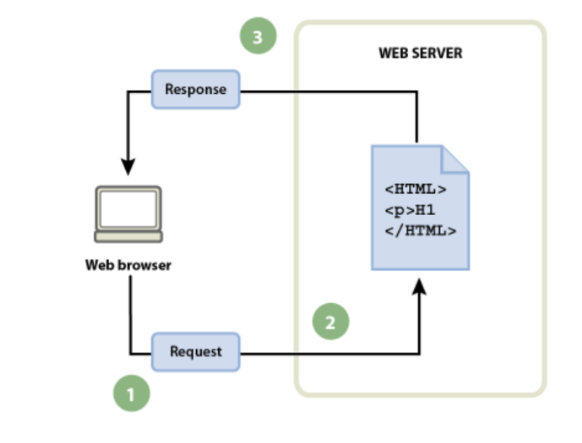

# Evaluación inicial

#### 1. ¿Qué es una página web?
Los sitios web están compuestos por páginas que suelen estar enlazadas a un menú general y su contenido gira en torno a un tema central. 
#### 2. ¿Qué es un sitio web?
Los sitios web están compuestos por páginas que suelen estar enlazadas a un menú general y su contenido gira en torno a un tema central. 
#### 3. ¿Qué es una aplicación web?
Una aplicación web es un software cliente-servidor que permite realizar funciones determinadas en internet, como enviar mensajes, realizar compras, editar imágenes, jugar videojuegos, hacer pagos, entre otras acciones.
#### 4. ¿Qué es una herramienta ofimática?
las herramientas ofimáticas son aquellos programas o aplicaciones que nos permiten manipular informáticamente la información con la que se trabaja de forma habitual en una oficina.

#### 5. [Herramientas de Google](https://www.google.com/intl/es-419/chrome/browser-tools/ "Herramientas de Google:")

|Aplicaciones | Vistos |
|----------|:----------:|
|Google Docs|✔️|
|Google Slides|✔️|
|Google Sheets|✔️|
|Google Calendar|📅|
|Google Meet|💻|
|...|...|

#### 6. ¿Qué es HTML ?
El Lenguaje de Marcado de Hipertexto (HTML) es el código que se utiliza para estructurar y desplegar una página web y sus contenidos. Por ejemplo, sus contenidos podrían ser párrafos, una lista con viñetas, o imágenes y tablas de datos.

```
<!DOCTYPE html>
<html lang="en">
<head>
    <meta charset="UTF-8">
    <meta http-equiv="X-UA-Compatible" content="IE=edge">
    <meta name="viewport" content="width=device-width, initial-scale=1.0">
    <title>Document</title>
</head>  
<body>

</body>
</html>
```
#### 7. ¿Qué es CSS?
CSS es uno de los lenguajes más importantes que se utilizan para ordenar las instrucciones referentes a la apariencia de un sitio y presentar los contenidos de una página de forma atractiva. 

#### 8. Flujo de trabajo (navegador, petición, servidor y respuesta):



